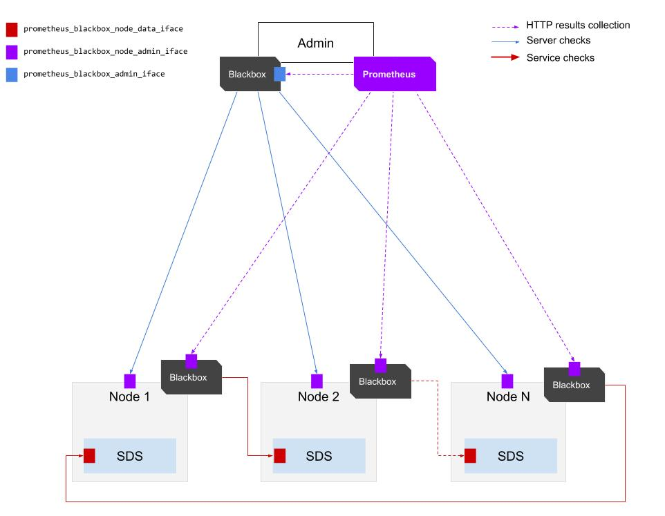

Monitoring stack playbook
---

[](https://travis-ci.org/open-io/ansible-openio-monitoring)

### Description

This playbook will deploy the Netdata/Prometheus/Grafana stack on an admin machine + N nodes. It comes preconfigured with an out of the box dashboard.


### Prerequisites:

- Ubuntu Xenial / CentOS 7
- Ansible 2.4 (see below for install on Ubuntu)
- python-netaddr package on admin machine

### Ansible 2.4 install

> **Ubuntu Xenial**
```sh
sudo bash
apt update
apt install -y software-properties-common
apt-add-repository -y ppa:ansible/ansible
apt update
apt install -y ansible python-netaddr
```

---

> **CentOS 7**
```sh
sudo yum install -y ansible python-netaddr
```

---

> **Other distribution**
```sh
virtualenv ansible24
cd ansible24/
. ./bin/activate
pip install --upgrade pip
pip install ansible>=2.4
```

---

### Setup

Download the latest release of this playbook and install role dependencies:

```sh
export OPENIO_MONITORING_RELEASE="2.2.3"
mkdir -p ~/ansible-openio-monitoring && cd ~/ansible-openio-monitoring
curl -sL "https://github.com/open-io/ansible-openio-monitoring/archive/$OPENIO_MONITORING_RELEASE.tar.gz" | tar xz --strip-components=1
ansible-galaxy install -r requirements.yml --force -p roles
```

You will need to **change your inventory file** according to [this example](inventory/default.ini).

```sh
cp inventory/default.ini inventory/current.ini
# vim inventory/current.ini
```

---

### Inventory

The inventory is organised by components and by node groups

- **openio**: all monitored nodes
- **admin** : admin node
- **prometheus**: node running prometheus (admin)
- **grafana**: node running grafana (admin)
- **alertmanager**: node running alertmanager (admin)
- **blackbox**: all nodes running blackbox_exporter (admin + monitored nodes)
- **netdata**: all nodes running netdata (monitored nodes)
---

### Configure

All configuration options are specified via **group_vars**. There are 5 services to be configured:

- [netdata](https://github.com/open-io/ansible-role-openio-netdata): Metric collection
- [blackbox](https://github.com/cloudalchemy/ansible-blackbox-exporter): Health checks
- [prometheus](https://github.com/open-io/ansible-role-openio-prometheus): Monitoring and alerting core
- [grafana](https://github.com/open-io/ansible-role-openio-grafana): Monitoring UI
- [alertmanager](https://github.com/cloudalchemy/ansible-alertmanager): Alert routing & notifications

Please refer to each role individually to learn more about advanced configuration options.

For an easy start, modify *inventory/group_vars/all.yml*. The configuration options are described below

| Option                                     | Description                                                        | Type    |
| ------------------------------------------ | ------------------------------------------------------------------ | ------- |
| alertmanager_receivers*                    | Alertmanager Receiver configuration                                | List    |
| alertmanager_inhibit_rules*                | Alertmanager inhibition rules configuration                        | List    |
| alertmanager_route*                        | Alertmanager main route configuration                              | Dict    |
| alertmanager_child_routes*                 | Alertmanager secondary routes configuration                        | List    |
| grafana_auth                               | Grafana user and password                                          | Dict    |
| openio_netdata_namespace                   | Namespace to monitor                                               | String  |
| openio_netdata_oio_container_plugin_target | Hostname of a node containing a redis used for the account service | String  |
| prometheus_storage_path                    | Path where metrics are stored                                      | String  |
| prometheus_default_admin_iface             | Network interface of the admin node                                | String  |
| prometheus_default_node_iface              | Network interface of the monitored nodes                           | String  |
| prometheus_default_collection_interval     | Collection interval                                                | String  |
| prometheus_blackbox_targets_regenerate**   | Regenerate targets for prometheus health collection                | Boolean |

> \* For more details see [here](https://github.com/cloudalchemy/ansible-alertmanager/blob/master/defaults/main.yml) and [here](https://prometheus.io/docs/alerting/configuration/)

> \*\* **Important note**: In the current implementation, health check target generation relies heavily on services being operational during playbook execution. If you wish however to redeploy the playbook on a partially failing platform, specify `prometheus_blackbox_targets_regenerate: false`, otherwise keep it at true at all times.

---

### Blackbox interface configuration diagram

The following diagram illustrates different interfaces are defined for blackbox



---

### Install

```sh
ansible-playbook -i inventory/current.ini main.yml
```

head to `http://[ADMIN_IP]:3000` and login with credentials (default `admin:admin`), then head to the dashboard named `Overview`.

---

### Upgrade

This repo contains an uninstall playbook. It is advised to run it before upgrading especially when upgrading from 2.x.

```sh
ansible-playbook -i inventory/current.ini playbooks/uninstall.yml
ansible-playbook -i inventory/current.ini main.yml
```

---

### Uninstall

```sh
ansible-playbook -i inventory/current.ini playbooks/uninstall.yml
```

---

### Troubleshoot

This section describes common troubleshooting procedures, in cases where the playbook has been successfully executed, and there are still problems with Grafana dashboards and/or other components.

**1. Check that prometheus is running:**

```
ansible -bi inventory/current.ini admin -m shell -a "systemctl status prometheus"
ansible -bi inventory/current.ini admin -m shell -a "netstat -lnp | prometheus"
```

> Fix: start prometheus `ansible -bi inventory/current.ini admin -m shell -a "systemctl start prometheus"`

Head to `http://[ADMIN_IP]:9090/targets` and verify that:
- All targets are blue
- There is a netdata target

**2. Check that netdata and blackbox are running:**

```sh
ansible -bi inventory/current.ini openio -m shell -a "systemctl status netdata blackbox_exporter"
```

> Fix: start services `ansible -bi inventory/current.ini openio -m shell -a "systemctl start netdata blackbox_exporter"`

**3. Check that netdata plugins are running:**

```sh
ansible -bi inventory/current.ini openio -m shell -a "ps aux | grep .plugin | grep -v grep"
```

Each node should have an the following plugins:
- python.d.plugin
- apps.plugin
- openio.plugin
- zookeeper.plugin

Additionally there needs to be one of the following plugins:
- container.plugin

> Fix: search netdata logs for plugin errors `tail -n 1000 /var/log/netdata | grep ERROR | grep [MALFUNCTIONING_PLUGIN]`

---

### Contribute

Issues, feature requests, ideas are appreciated and can be posted in the Issues section.

Pull requests are also very welcome. The best way to submit a PR is by first creating a fork of this Github project, then creating a topic branch for the suggested change and pushing that branch to your own fork. Github can then easily create a PR based on that branch.
